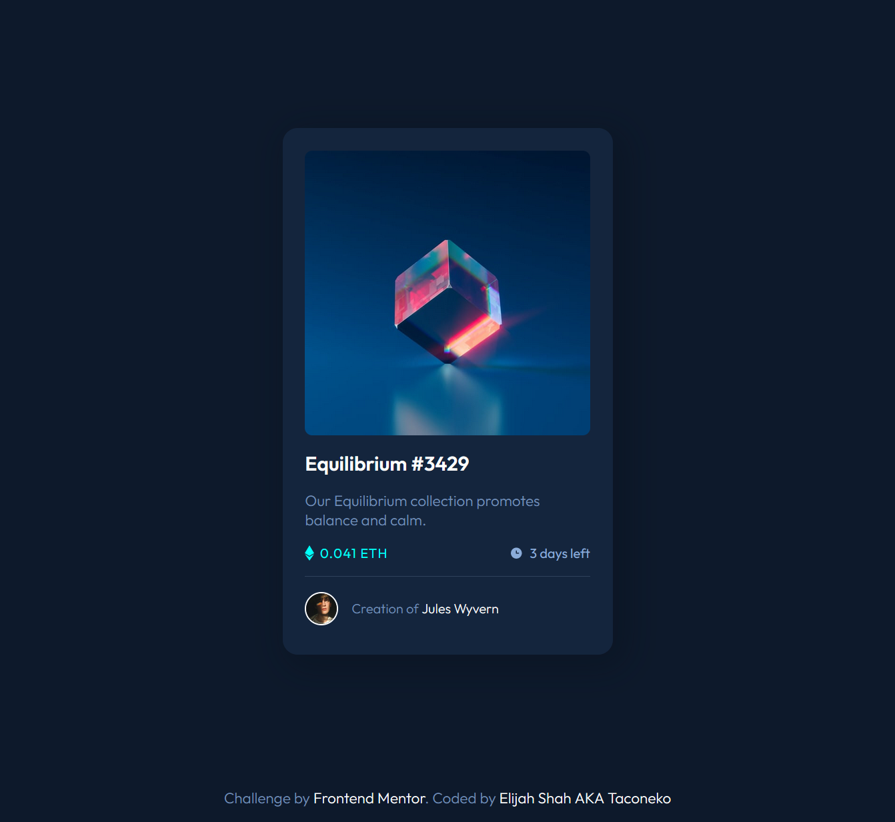

# Frontend Mentor - NFT preview card component solution

This is a solution to the [NFT preview card component challenge on Frontend Mentor](https://www.frontendmentor.io/challenges/nft-preview-card-component-SbdUL_w0U). Frontend Mentor challenges help you improve your coding skills by building realistic projects. 

## Table of contents

- [Overview](#overview)
  - [The challenge](#the-challenge)
  - [Screenshot](#screenshot)
  - [Links](#links)
- [My process](#my-process)
  - [Built with](#built-with)
  - [What I learned](#what-i-learned)
  - [Continued development](#continued-development)
- [Author](#author)

## Overview

Quick little challenge, practicing with `::before` and `::after` pseudo elements. Well, just `::before` in this one.

### The challenge

Users should be able to:

- View the optimal layout depending on their device's screen size
- See hover states for interactive elements

### Screenshot

### Links

- Solution URL: [Add solution URL here](https://your-solution-url.com)
- Live Site URL: [Add live site URL here](https://your-live-site-url.com)

## My process

I wanted something easier to do today after the Javascript hell I experienced with the rating component. This was a cool exercise in using pseudo elements.

I tried to use a pseudo element for the hover effect on the image too, but the centering was off and nobody else seemed to do that kind of thing unless it was a plain solid color, or an entirely different image. I guess it just doesn't work with icons.

### Built with

- Semantic HTML5 markup
- CSS custom properties
- CSS pseudo elements
- Flexbox
- Sass

### What I learned

I had to figure out a lot about how to position pseudo elements properly. Also? Whoever provided those Ethereum and clock icons with a bunch of transparent pixels at the bottom? Evil. I was getting so mad trying to figure out why the centering wasn't perfect.

### Continued development

Pseudo elements seem really fun and useful. I like not having my HTML cluttered by purely decorative icons, so it's perfect for that. I'll start using them a lot more.

## Author

- Frontend Mentor - [@taco-neko](https://www.frontendmentor.io/profile/taco-neko)